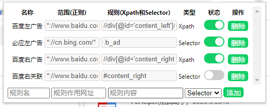

# HandlePage
## 简介
HandlePage是一个Chrome扩展插件，其主要作用是对页面的DOM元素进行处理
+ 人话：对页面的内容进行处理
+ 支持的规则：Xpath和Selector

使用HandlePage的用途：按照规则对不想看见的内容进行删除(比如广告)

## 使用
+ HandlePage提供了默认的规则
+ 添加自定义规则

+ **各项参数意义**
  + 名称：规则名
  + 范围：用来指定激活的网页url地址(支持正则)
  + 规则：寻找页面内容的Selector或者Xpath

## 展望
因为使用此扩展对普通用户来说不太友好(毕竟规则奇奇怪怪的嘛!)
+ 后续可能会添加导入功能
+ 或者像Tampermonkey(油猴插件)一样,提供页面增加规则
+ 现如今的生态并未扩大

扩展由于作者本人还未注册Chrome开发者，暂未上线于谷歌商店
+ 可以没事去搜一搜，因为上线后作者基本懒得改README文件
